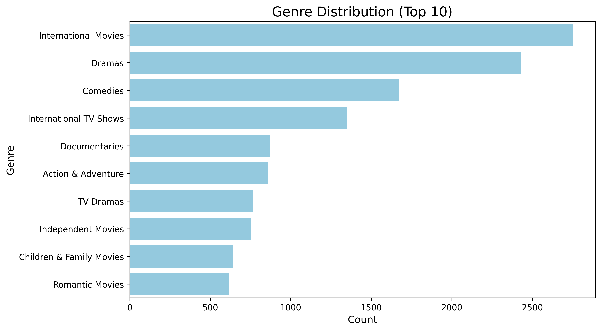
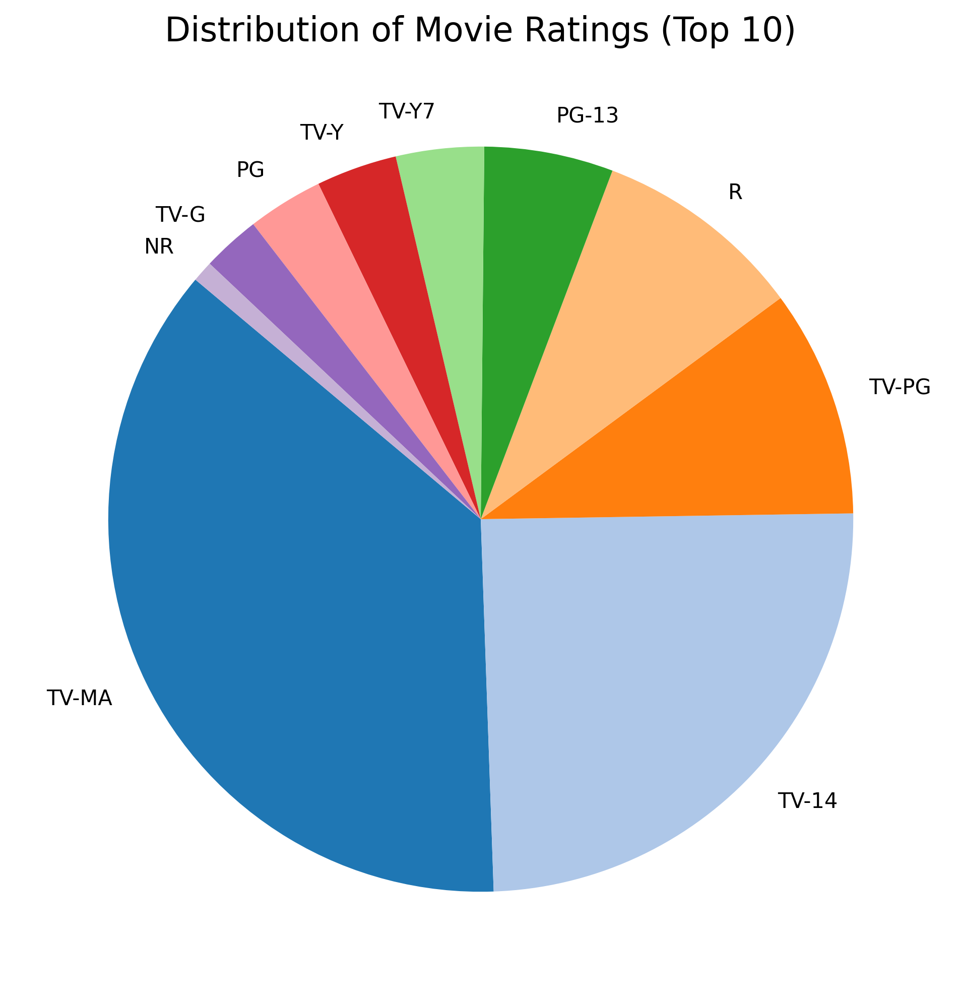
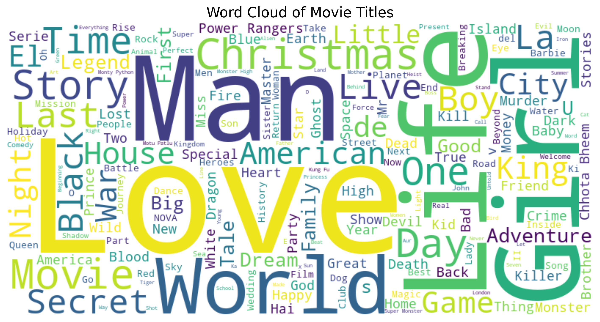
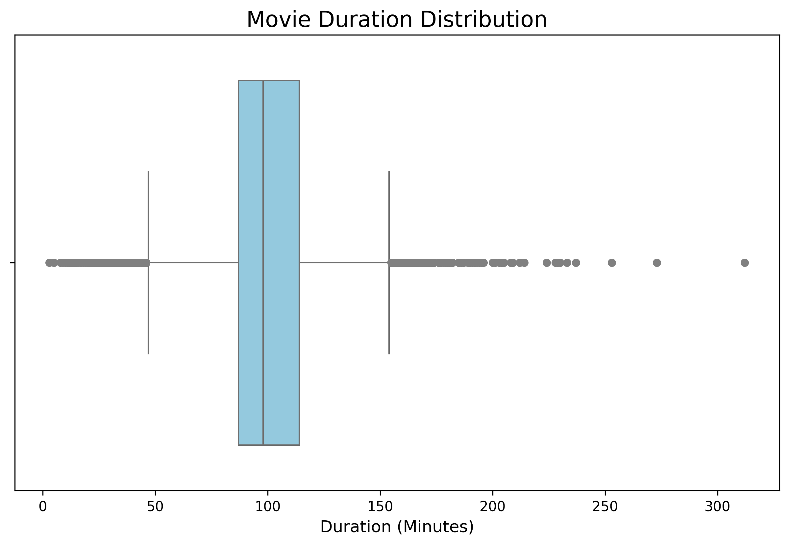
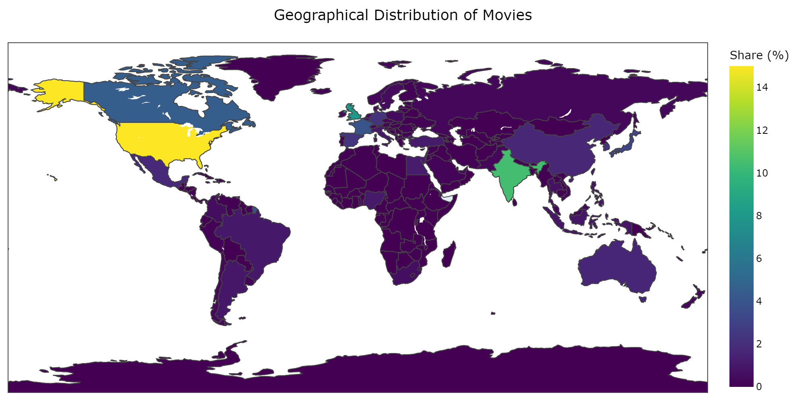
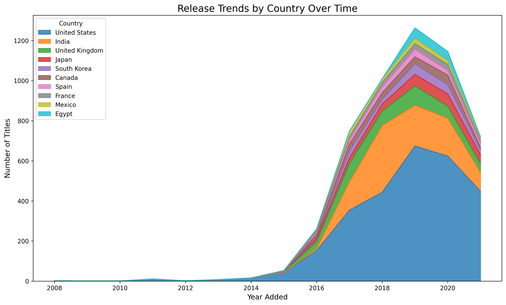
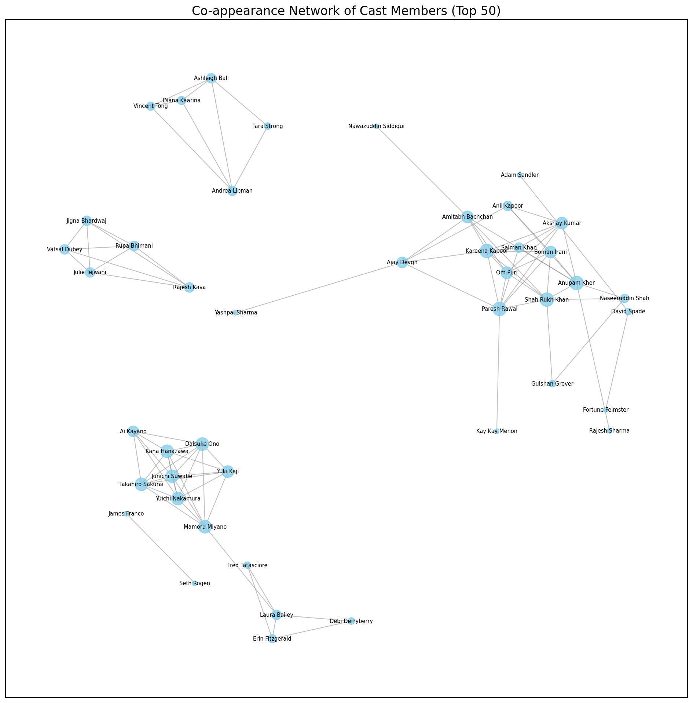

# A Visual Analysis of Netflix Content Library: Patterns, Genres, and Trends

This project is an exploration and visualization of Netflix's movie and TV show dataset. The goal is to uncover trends, patterns, and insights using advanced information visualization techniques.

The following visualizations are included in the project:

**1. Content Over Time**:
Line plot illustrating the growth of movies and TV shows on Netflix over the years

**2. Genre Distribution**:
Horizontal bar chart showing the most frequent genres in Netflix's library

**3. Distribution of Movie Ratings**:
Pie chart visualizing the top 10 ratings of Netflix's movies and TV shows

**4. Word Cloud of Movie Titles**:
Highlighting the most common words in Netflix titles

**5. Movie Duration Distribution**:
Box plot showing the typical runtime of Netflix movies

**6. Geographical Distribution of Movies**:
Choropleth map visualizing the number of titles contributed by different countries

**7. Release Trends by Country Over Time**:
Area chart showing the temporal growth of Netflix content by country

**8. Co-appearance Network of Cast Members**:
Network graph visualizing collaborations between top cast members

